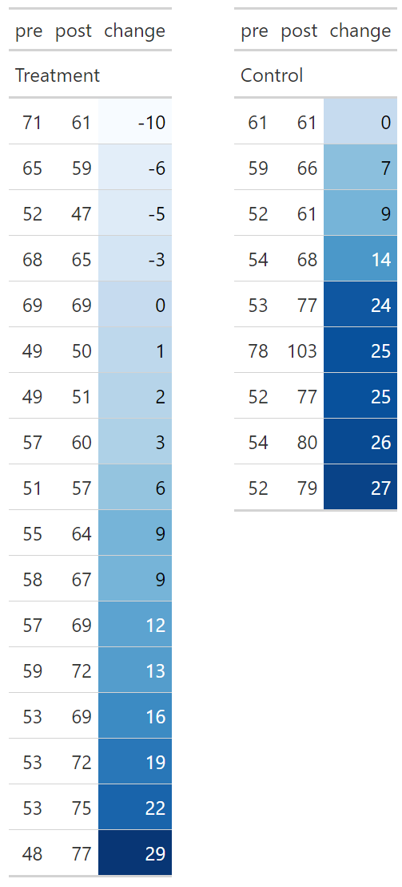
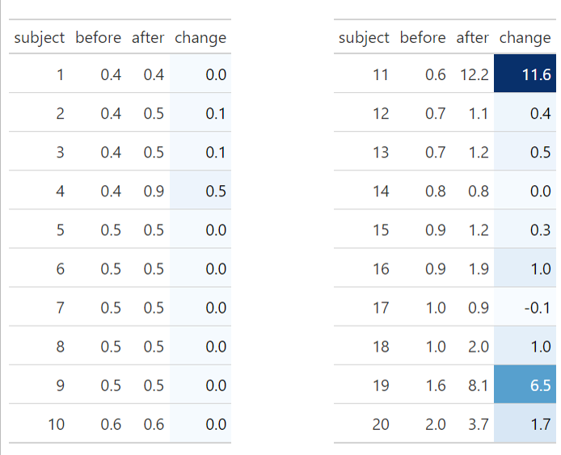

```{r setup, include=FALSE}

knitr::opts_chunk$set(echo = FALSE, 
                      warning = FALSE, 
                      message = FALSE, 
                      fig.align='center')
library(tidyverse)
library(haven)
library(gt)
library(scales)
library(modelsummary)
theme_set(theme_minimal())


```


## Exercise  1 

A study was made of all 26 astronauts on the first eight space shuttle flights (Bungo et al., 1985). On voluntary basis 17 astronauts consumed large quantities of salt and fluid prior to landing as a countermeasure to space de-conditioning, while nine did not. The table below shows supine heart rates (beats/minute) before and after flights in the space shuttle. Please use the data in file ex5_1.sav


```{r show-raw, eval=FALSE, include=FALSE}


df <- read_sav("data/ex5_1.sav") |> 
  mutate(across(where(is.double), as.double)) |> 
  mutate(
    counter = fct_recode(
      factor(counter), 
      countermeasure = "0", 
      no_countermeasure = "1")
    )

get_tab <- function(df) {
  df |> 
  gt() |> 
  tab_row_group(
    label = "Treatment",
    rows = counter == "countermeasure"
  ) |> 
  tab_row_group(
    label = "Control",
    rows = counter == "no_countermeasure"
  ) |>  
  cols_hide(4) |> 
    data_color(columns = c("change"), 
               fn = col_numeric(palette = "Blues", 
                                    domain = c(-10, 30))) 
}

tab1 <- df |> 
  slice(1:17) |> 
  get_tab()
tab2 <- df |> 
  slice(18:26) |> 
  get_tab()

library(gtExtras)
listed_tables <- list(tab1, tab2)
gt_two_column_layout(listed_tables)

# gt_two_column_layout(listed_tables, output = "save",
#                      filename = "q1-img-1.png")


```

```{r q1-img-1, fig.align='center', echo=FALSE}

```


(a) Compare the pre-and post-flight measurements in the countermeasure group using both a parametric and a non-parametric approach. Formulate your null hypothesis and alternative. Which analysis is preferable, and why?


**ANSWER:** Before starting, let's run some simple exploratory analysis to get a feel for the data

```{r 1-a-EDA, echo=TRUE, fig.height=4}
library(haven)
df <- read_sav("data/ex5_1.sav") |> 
  mutate(
    counter = factor(
      counter, 
      levels = c(0, 1),
      labels = c("control", "treatment")
    )
  )


df |> 
  mutate(counter = fct_rev(counter)) |>  
  ggplot(aes(y = change, x = counter)) +
  geom_violin() +
  labs(x = NULL) +
  theme_minimal()

```


The figures above can help us evaluate the distributions of our data, suggesting that the distribution of change in the treatment (countermeasure) group appears to be closer to a normal distribution than that of the control group. 

We can now turn to the analysis itself. Let's begin with the parametric approach (assuming normality of observations). 


For the parametric approach: 
$$
H0: \delta = 0 \\ 
H1: delta \ne 0
$$


```{r 1-a-param, echo=TRUE}

# parametric approach
df_treat <- df |> 
  filter(counter == "treatment")  

t <- t.test(df_treat$change) 
t

```

Using a paired t-test (which is identical to a single sample t-test of the difference), we get a `t$p.value`= `r format(round(t$p.value, 4))`; 95% CI for mean difference is `t$conf.int = ` [`r round(t$conf.int, 3)`].

**Conclusion:** reject H0 that the mean change equals zero at the $\alpha = 5\%$ level;

Let's explore the non-parametric testing. Here our null hypothesis assumes that the pre and post measurement come from the same symmetric distribution; Let's run the Wilcoxon signed rank test. 

```{r 1-a, echo=TRUE}

df_treat <- df |> 
  filter(counter == "treatment")  

# non-parametric approach
w <- wilcox.test(df_treat$change, correct = FALSE, exact = FALSE) 
w
```

**ANSWER:** The `w$p.value` = `r w$p.value`; Reject the null hypothesis;


(b) In the light of the answer to (a), perform a suitable analysis to compare changes in heart rate in two groups. Formulate again first your null hypothesis and alternative. What conclusions can be made about the effectiveness after of the countermeasure?


**ANSWER:** The treatment group appears to be normal, the control group less so. 


```{r 1-b, echo=TRUE}

# non-parametric approach
w <- wilcox.test(df$change ~ df$counter,  
            exact = FALSE, 
            correct = FALSE) 
w

```

Our p-value is  `w$p.value =` `r round(w$p.value, 4)`, the same as SPSS asymptotic significance test. SPSS also reports the result of an exact test, but R complains when we try to set the `exact` argument to TRUE. In any case, since P < 0.05 we can reject the null hypothesis. There is a tendency of larger changes in the group that did not take countermeasures.


(c) Two astronauts each flew on two missions and are thus presented twice in the data. Why does this matter?

**ANSWER:** It is incorrect to analyze multiple observations on the same individuals as if they were from different people. The assumption of independence is not satisfied. Information coming from the same source is treated as if it came from independent sources, which means that we are overestimating our degrees of freedom and therefore we are more likely to make errors of type I. 


(d) Comment on the voluntary aspect of the study, and how it might affect on the interpretation of the results.

**ANSWER:** In clinical research it is highly undesirable to let subjects choose their own treatments. No clinical trial conducted in this way would have credibility. Ideally (from the research point of view) the astronauts should have been randomized to receive the dietary countermeasure, but this was not set up as a prospective study


## Exercise  2

The Table below shows concentration of antibody to Type III Group B Strepoccus (GBS) in 20 volunteers before and after immunization (Baker et al., 1980). See also data file ex5_2.sav. 

```{r create-pic, eval=FALSE}


df <- read_sav("data/ex5_2.sav")  |> 
  mutate(across(where(is.double), as.double)) |> 
  mutate(change = after - before) 


get_tab <- function(df) {
  df |> 
  gt() |> 
    data_color(columns = c("change"), 
               colors = col_numeric(palette = "Blues", 
                                    domain = c(-0.1, 11.6))) 
}

tab1 <- df |> 
  slice(1:10) |> 
  get_tab()
tab2 <- df |> 
  slice(11:20) |> 
  get_tab()

library(gtExtras)
listed_tables <- list(tab1, tab2)
gt_two_column_layout(listed_tables)

gt_two_column_layout(listed_tables, output = "save",
                     filename = "q1-img-2.png",
                      vwidth = 450, vheight = 520)

df |> 
  gt()
df |> 
  datasummary_skim()

df |> mutate(change = after - before) |> 
  ggplot(aes(change, after_stat(density))) + 
  geom_histogram(binwidth = .25) + 
  theme_minimal()


```


```{r q1-img-2, fig.align='center', fig.height=3, echo=FALSE}


df <- read_sav("data/ex5_2.sav")  |> 
  mutate(across(where(is.double), as.double)) |> 
  mutate(change = after - before) 


df |> 
  ggplot(aes(change, after_stat(density))) + 
  geom_histogram(binwidth = .25) 

```


(a) Formulate the H0 for the comparison of the antibody levels before and after immunization.

**ANSWER:** H0: mean concentration before immunization equals the mean concentration after immunization in the population; H1: H0 not true

(b) The comparison was summarized in the report of this study as `t=1.8; P-value > 0.05` Comment on this result. What method would be more appropriate, and why?

```{r 42b, echo = TRUE}

t <- t.test(df$change)
t

```


**ANSWER:** The paired t-test gives `t$p.value` = `r round(t$p.value, 3)`. However, the test assumes that the differences have reasonably Normal distribution, which is clearly not the case here. A log transformation does not solve the problem; the distribution is still skewed. The nonparametric approach is therefore recommended: the Wilcoxon signed rank sum test assumes a symmetric distribution of the differences, which is not the case. The Sign test can be used.


(c) Analyze the data with the method you mentioned in (b); what are your conclusions?

```{r q2-c, echo=TRUE}

w <- wilcox.test(df$change, correct = TRUE, exact = FALSE) 
w

```

**ANSWER:** As before, R complains when we try to run an exact test. The results of an asymptotic test yields a p-value of 0.00412. SPSS calculates a P-value = 0.006; 

In both cases, we reject the null hypothesis that the data before immunization come from the same population as the data after immunization. After immunization, people appear to have higher concentrations than before.


## Exercise  3

40 Patients receiving chemotherapy as outpatients were randomized to receive either an active antiemetic treatment (n=20) or placebo (n=20) (Williams et al., 1989). The following table shows measurements (in mm) on a 100 mm linear analogue self-assessment scale for nausea. See also data file ex5_3.sav.

```{r q3-load, fig.height=3}

df <- read_sav("data/ex5_3.sav")  |> 
  mutate(across(where(is.double), as.double)) |> 
  mutate(group = fct_recode(as.factor(group), 
                             treatment = "1", placebo = "2"))

df |> 
  ggplot(aes(x = group, y = nausea)) + 
  geom_violin() 

```


(a) Formulate your H0 and alternative to compare the values in both groups.

**ANSWER:** H0: mean nausea is the same for both groups in the population; H1: H0 not true

(b) Which analysis is appropriate to test this null hypothesis, and why?

**ANSWER:** The data do not meet the distributional assumptions for parametric methods based on the t-distribution. The groups can be compared using the non-parametric Mann-Whitney test, which tests the null hypothesis that the data in both groups come from the same distribution.


(c) Perform the test. What are your conclusions?

The test is run using the code below:


```{r q3-tests, echo=TRUE}

wilcox.test(df$nausea ~ df$group, 
            correct = TRUE, 
            exact = FALSE)  

```

**ANSWER:** The result is significant, the non-parametric P = 0.001 (also for the SPSS output). We can reject our null hypothesis, the placebo group has a tendency to result in higher nausea scores.


## Exercise  4

Patients with chronic renal failure undergoing haemodialysis were divided into groups with low or normal plasma heparin cofactor II (HCII) levels (Toulon et al., 1987). Five months later the acute effects of haemodialysis were studied by analyzing plasma samples taken before and after haemodialysis. As dialysis increases total protein concentration in plasma, the ratio of HC II to protein was calculated with results
shown in the following table:

These data are also in the data file ex5_4.sav. The aim was to compare the change in both groups. The data were analyzed by separate paired Wilcoxon tests on thedata for each group, giving P-value < 0.01 for group 1 and P-value > 0.05 for group 2.

```{r q4-load}

df <- read_sav("data/ex5_4.sav")  |> 
  mutate(across(where(is.double), as.double)) |> 
  mutate(group = fct_recode(as.factor(group), 
                             low = "1", normal = "2"), 
         change = after - before) 

df |> 
  ggplot(aes(x = group, y = change)) + 
  geom_violin()  + labs(x = NULL)


```


(a) Why is it wrong to conclude, as the authors did, that HC II activity increased in group 1 but not in group 2?

**ANSWER:** Let's run the tests, using the code below. First, let us test the group with a low HCII:

```{r q4-a-low, echo=TRUE}

df_low  <- df |> filter(group == "low")
w <- wilcox.test(df_low$change, exact = FALSE)   # p = 0.01347
w

```

We find a significant result with a p-value of `w$p.value =` `r w$p.value`. What about the group with a normal HCII?


```{r q4-a-normal, echo=TRUE}

df_normal  <- df |> filter(group == "normal")
w <- wilcox.test(df_normal$change, exact = FALSE)  # p = 0.09084
w

```

The p-values associated with paired Wilcoxon tests of the data for groups 1 and 2 are 0.0135 and 0.091 (in SPSS 0.01 and 0.08). Moreover, the mean changes in the two groups are almost the same. The correct way to compare the groups is by testing directly the difference between changes in the two groups. The two sample t-test or the Mann-Whitney test.


(b) Carry out a better analysis to compare the change in both groups: formulate first your H0 and alternative. What are your conclusions?

**ANSWER:** As before, H0: the mean change is in both groups the same, delta_1 - delta_2 = 0; H1: delta_1 - delta_2 != 0; Using Levene's test, we test whether the variance is equal in both groups:

```{r q4-b-levene, echo=TRUE}
car::leveneTest(df$change ~ df$group)  

```
From Levene's test it is known that we can not reject the hypothesis that the variances are equal (R reports p-value 0.23, SPSS reports p-value = 0.14), and since there is no indication that the data in both groups are not normally distributed, the two sample t-test can be used under the assumption of equal variance. 


```{r q4-b-t-test, echo=TRUE}
t.test(df$change ~ df$group, var.equal = TRUE) 
# p = 0.878

```
The t-test shows a p-value= 0.88 (and the same value shown in R and SPSS); so we do not reject the null hypothesis. There is no significant difference between the two groups. Let's check the non-parametric test.

```{r q4-b-nonparam, echo=TRUE}
wilcox.test(df$change ~ df$group, exact = FALSE) 
# p = 0.453
```

 Non-parametric Wilcox shows p-value of 0.453, which does not change our decision about not rejecting the null hypothesis: The groups do not suggest a significant difference between the two groups. 

## Exercise  5

A group of 20 patients in remission from Hodgkin’s disease and a group of 20 patients in remission from other diverse, disseminated malignancies (called the non-Hodgkin's disease group) were compared with respect to the number of T4 cells per mm3 in their blood. In the Table below the numbers are given. See also data file ex5_5.sav.


```{r q5, echo = FALSE}

df <- read_sav("data/ex5_5.sav")  |> 
  mutate(across(where(is.double), as.double)) |> 
  mutate(
    group = fct_recode(
      as.factor(group),
      hodg = "1", non_hodg = "0")
    )  |> select(-t8)

df |> 
  ggplot(aes(x = group, y = t4)) + 
  geom_violin() + 
  theme_minimal()


```

(a) Which method is for these data more appropriate to test the null hypothesis that the numbers are the same in groups, the parametric approach or the non-parametric approach? Motivate your answer, and perform the analysis.


```{r q5-a, echo=TRUE}

wilcox.test(df$t4 ~ df$group, exact = FALSE) 

```

We choose the non-parametric approach, since the data are rather skewed. The Mann-Whitney test gives a P-value of 0.08. So there is no indication that both groups differ with respect to the T4-counts.


(b) Try a logarithmic transformation (ln), and check whether a parametric approach is appropriate on these transformed data. Perform the parametric test. What is your conclusion?

```{r q5-b, echo=TRUE}

df |> 
  ggplot(aes(x = group, y = t4)) + 
  geom_violin() + 
  scale_y_log10() + 
  theme_minimal()

```


**ANSWER:** After the transformation, the data are less skewed, and more importantly, it can be assumed that the variances are equal (based on the Levene's test below).


```{r q5-b-levene, echo=TRUE}

car::leveneTest(log(df$t4) ~ df$group)  # p_value = 0.320 --> cannot reject same variance

```


Below you can see the result of the two-sample t-test gives a P-value of 0.07; this is very close to the nonparametric results (p = 0.08). 


```{r q5-b-param-nonparam, echo=TRUE}

t <- t.test(log(df$t4) ~ df$group, var.equal = TRUE)   # p = 0.0682
t

w <- wilcox.test(log(df$t4) ~ df$group, exact = FALSE)  # p = 0.0810
w

```

The null hypothesis cannot be rejected, indicating that we have no evidence for difference in the means T4 in both groups. 


(c) Make a 95% confidence interval on the transformed data to compare both groups, and interpret the results. What is your conclusion?


**ANSWER:** The CI on the log scaled transformed data is [`r round(t$conf.int, 3)`]. After backwards transformation the 95% CI can be calculated using exponentiation `exp(t$conf.int) = ` `r exp(t$conf.int)`. 

**Interpretation:** we are for 95% confident that the ratio of both geometric means is within this interval.

## Exercise  6


Twenty-two patients undergoing cardiac bypass surgery were randomized to one of three ventilation groups: Group I received a 50% nitrous oxide and 50% oxygen mixture continuously for 24 hours; Group II received a 50% nitrous oxide and 50% oxygen mixture only during the operation; Group III received no nitrous oxide and 35-50% oxygen mixture continuously for 24 hours. In data file ex5_6.sav, the red cell folate levels for the three groups after 24 hours ventilation are given. The aim of this study was to compare the three groups and test whether they have the same red cell folate levels.

(a) Make a scatter plot of the data (group on the horizontal line). Based on this plot, what are your first conclusions with respect to the mean and variances of the different groups?

```{r q6-load, fig.height=4}
df <- read_sav("data/ex5_6.sav")  |> 
  mutate(
    group = factor(
      group, 
      levels = c(1, 2, 3), 
      labels = c("group 1", "group 2", "group 3")
      ) 
  )

df |> 
  ggplot(aes(x = group, y = rcfl)) + 
  geom_violin() + 
  labs(x = NULL) + 
  theme_minimal()

```

**ANSWER:** The groups seem to be different with respect to their means, but also with respect to their variation (range has different length)

(b) Perform a one way ANOVA, and interpret the results. Are the conditions satisfied?

```{r q6-b, echo = TRUE}
aov(rcfl ~ group, data = df)  |> 
  summary()
```


**ANSWER:** The ANOVA reveals significant results P= 0.044; this means that the null hypothesis of equal means in the three groups must be rejected. However, according to the test of homogeneity of variances, the hypotheses of equal variances must be rejected. A transformation must be considered.


(c) Try a log transformation on the data, and perform again a one-way ANOVA. Are now the assumptions satisfied?

**ANSWER:** The test of equal variances for the transformed data reveals that the assumption of equal variances can be made. Test results for the ANOVA: P-value = 0.049. This is on the boundary of significance. There is indication that at least one pair of groups have different means.

(d) Which means do differ according to you? Why?

```{r}
pairwise.t.test(df$rcfl, df$group, p.adj = "bonf") 

```


**ANSWER:** From the paired comparisons with Bonferroni-corrections it appeared that group1 and group 2 differ with respect to their means (but on the boundary, P-value = 0.047).

(e) Try a non-parametric approach on these data. What are now your conclusions?

```{r}
kruskal.test(rcfl ~ group, data = df)

```


**ANSWER:** The Kruskal-Wallis test gives P-value = 0.123: no significant differences between the three groups

(f) In the light of the previous answers, what would your conclusion be about the differences between the groups?

**ANSWER:** In a paper, you should be very careful to give the conclusion that there are differences between the three groups. You might stay on the safe side, and publish the non-parametric results.
