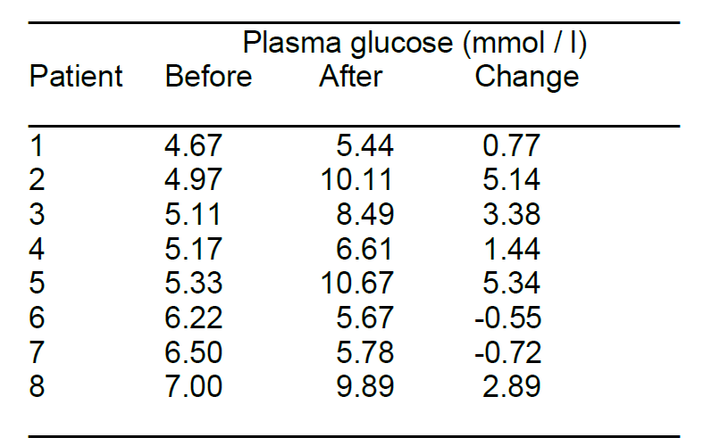

```{r setup, include=FALSE}

knitr::opts_chunk$set(echo = TRUE, 
                      warning = FALSE, 
                      message = FALSE, 
                      fig.align='center')
library(tidyverse)
library(broom)
library(haven)
library(gt)
library(scales)
library(modelsummary)
library(patchwork)
theme_set(theme_minimal())

options(digits = 4)

```

## Exercise 1


There are two hospitals in town. On average 45 deliveries take place each day in the larger hospital, and 15 in the smaller. The probability of a baby being a boy is about 0.52, and the probability of twins is about 0.012. 

(a) On any day which hospital is more likely to have a set of twins delivered

**Answer** The larger hospital, simply because there are more births. (This question is about an **absolute number**: a set of twins). To make the differences more clear: take a very small hospital (only one delivery per day) and a very large hospital (1000 deliveries a day).
The probability that the delivery in the small hospital will consist of twins is 0.012. The same is true for each delivery in the larger hospital, but since we have 1000 deliveries, we expect about 12 of them to consist of twins. 

Using R we calculate the probability of having `k` or more twins out of a sample of size `n` when the probability of having a twin is `p` using the formula  `pbinom(k - 1, n, p, lower.tail = FALSE)`. To answer the question, we set $k=1, p = 0.012$. 

-   For the large hospital, setting $n=45$ yields a probability of delivering at least one twin: `r pbinom(1 - 1, 45, .012, lower.tail = FALSE)` 
-   For the small hospital, setting $n=15$ yields a probability of `r pbinom(1 - 1, 15, .012, lower.tail = FALSE)` to deliver at least one twin.


```{r ex1-a, echo=FALSE}
# Probability of having one or more twins
# in a sample of 15
t1 <- tibble(
  x = 0:15,
  p = dbinom(x, 15, 0.012), 
  k = c("k = 0", rep("k > 0", 15)),
  hospital = rep("Small hospital (n = 15)", 16)
  ) 
# in a sample of 45
t2 <- tibble(
  x = 0:45,
  p = dbinom(x, 45, 0.012), 
  k = c("k = 0", rep("k > 0", 45)),
  hospital = rep("Large hospital (n = 45)", 46)
  ) 

t1 |> 
  add_row(t2) |> 
  filter(x < 6) |> 
  mutate(hospital = fct_rev(hospital)) |> 
  ggplot(aes(x, p, fill = k)) + 
  geom_col() + 
  theme(legend.position = "none") + 
  labs(
    y = "Probability (sqrt scale)", 
    x = "Number of twins delivered per day"
    )   + 
  scale_x_continuous(limits = c(-1, 6), breaks = 0:15) + 
  scale_y_sqrt(breaks = c(0.01, 0.10, 0.25, 0.5, 0.8)) +
  scale_fill_manual(values = c(
    "k = 0" = "lightgray", 
    "k > 0" = "black"
    )
  ) + 
  facet_wrap(~hospital) + 
  theme(text = element_text(size = 14))

```


(b) On any day which hospital is more likely to have more than 60%  of babies being boys?


**Answer** The day to day variation in the proportion of boys will be greater in the smaller hospital, so it is more likely to have more than 60 % of babies being boys on any day. (This question is about a relative number: 60% of the babies). 

Again, to make the differences more clear: take a very small hospital (only one delivery per day) and a very large hospital (1000 deliveries a day). In the small hospital, the probability that the child is a boy is 0.52. If a boy is born, 100% of the babies is a boy. This will happen in 52% of the days. For the larger hospital, we expect to see 520 boys and 480 girls on an arbitrary
day. Some days there will be more than 520 boys, other days there will be less than 520 boys. But the probability that more than 60% of the children (more than 600 out of 1000) will be boys, is very small, definitely smaller than 0.52.


```{r}

# pbinom(0.6 * 15 - 1, 15, .52, lower.tail = FALSE)
# pbinom(0.6 * 45 - 1, 45, .52, lower.tail = FALSE)

# Probability of having one or more twins
# in a sample of 15
t1 <- tibble(
  x = 0:15,
  p = dbinom(x, 15, 0.52), 
  k = c(rep("< 60%", 9), rep(">= 60%", 7)),
  hospital = rep("Small hospital (n = 15)", 16)
  ) 

# in a sample of 45
t2 <- tibble(
  x = 0:45,
  p = dbinom(x, 45, 0.52), 
  k = c(rep("< 60%", 27), rep(">= 60%", 19)),
  hospital = rep("Large hospital (n = 45)", 46)
  ) 

t1 |> 
  add_row(t2) |> 
  filter(p > .00005) |> 
  mutate(hospital = fct_rev(hospital)) |> 
  ggplot(aes(x, p, fill = k)) + 
  geom_col() + 
  theme(legend.position = "bottom") + 
  labs(
    y = "Probability", 
    x = "Number of male babies delivered per day", 
    fill = "percent boys"
    )   + 
  scale_x_continuous(breaks = seq(0,45, 3)) + 
  scale_y_sqrt(breaks = c(0, .01, .03, .07, .13, .2)) +
  scale_fill_manual(values = c(
    "< 60%" = "lightgray", 
    ">= 60%" = "black"
    )
  ) + 
  facet_wrap(~hospital, scales = "free_x") + 
  theme(text = element_text(size = 14))

```


Using R, the probability for delivering a boy is 52% for both hospitals, but for the small hospital, set $k = 0.6\cdot15=9$ (out of 15 deliveries a day), and for the large hospital set $k = 0.6\cdot45=27$ boys (out of 45 deliveries a day). 

-   For the small hospital, setting $n=15$ yields a probability of `r pbinom(9 - 1, 15, .52, lower.tail = FALSE)` to deliver at least 9 baby boys out of 15 daily deliveries.
-   For the large hospital, setting $n=45$ yields a probability of delivering at least one twin: `r pbinom(27 - 1, 45, .52, lower.tail = FALSE)` to deliver at least 27 baby boys out of 45 daily deliveries. 


## Exercise 2

Eight diabetic patients had plasma glucose levels (mmol / l) measured before and one hour after oral administration of 100g glucose (Feingold e.a., 1989), with the following results

```{r img-Q4.2, echo=FALSE}



```


(a) Calculate the standard error of the mean change in plasma glucose.


**Answer** The SE of the mean is $\frac{\sigma}{\sqrt{n}}$. We cannot observe the population standard deviation $\sigma$ so we have to estimate it using the sample standard deviation, $s$. 
To calculate the standard error manually, we need to first calculate the mean:

$$
\bar{X} = \frac{0.77 + 5.14 + 3.38 + 1.44 + 5.34 – 0.55 – 0.72 +
2.89}{8} = 2.211
$$

Now we can calculate the calculation of the sample standard deviation, $s$

$$
s^2 = \frac{(0.77-2.21)^2+\ldots+(2.89-2.21)^2}{8-1} =5.583
$$
The sample standard deviation is therefore $s=\sqrt{5.5823}=2.363$, and the standard error is $sd.err = \frac{2.363}{\sqrt{8}}=0.8354$

Calculate it using the following code: 

```{r 4.2_a, echo = TRUE}

x <- c(0.77, 5.14, 3.38, 1.44, 5.34, -0.55, -0.72, 2.89)
sd.err <- sd(x) / sqrt(length(x))

t <- t.test(x)
t

```

And the one-sample t-test shows that the standard error is `sd.err` = `r sd.err`. Alternatively, we can use the result of the t-test is `t$stderr` = `r t$stderr`. 

(b) Give a 95 % CI for the mean change based on these data (Assume that the Normal distribution is the appropriate sampling distribution for the change in plasma glucose).

**Answer**  Since the population standard deviation $\sigma$ is unknown, we use the sample sd as an estimate. As a consequence we cannot use the z-value 1.96 in constructing a 95% confidence interval nor a 95% reference interval. From the result of our t test we can see that the number of degrees of freedom is `t$parameter` = `r t$parameter`, and the critical value $t_{df, 1-\alpha/2}$ can be calculated as `qt(0.975, df = 7)` = `r qt(0.975, df = 7)`. The formula for the 95% confidence interval is: 


$$
CI = \bar{X} \pm t_{df, 1-\alpha/2} \cdot\frac{\sigma}{\sqrt{n}} =2.211\pm2.365\cdot0.8354
$$

The confidence interval can also be directly extracted from our t test. It is therefore `t$conf.int ` = $[$ `r round(t$conf.int, 2)` $]$.


(c) On the basis of these data, how many diabetic patients would need to be studied so that the width of the 95% CI for the mean change was 0.5 mmol per liter? 


**Answer**:  with a larger n, the coefficient for the 95% CI will be around 1.96, so the CI will look like $[\bar{x} - 1.96\cdot SE , \bar{x} + 1.96\cdot SE]$. The width of this interval is $2\cdot1.96\cdot SE$. So we need to solve the equation: 

$$
2\cdot1.96\cdot\frac{\sigma}{\sqrt{n}} = 0.5
$$
Where we estimate the $\sigma$ by using the sample standard deviation of our sample $s = 2.3629$. We thus have

$$
2\cdot1.96\cdot\frac{s}{0.5} = \sqrt{n}
$$


We would thus find that $n \approx (2*1.96*2.3629/.5)^2 = 343$. We need a sample of about $n \ge 343$ to obtain a confidence interval that is about 0.5 mmol per liter or less. 


## Exercise 3


(a) In a clinical trial in which a total of 100 patients are allocated to two treatments A and B by simple randomization (tossing a coin for each new patient). Calculate the probability that the difference between the numbers of patients in the two treatment groups exceeds 20. (Hint: the number of individuals in one treatment group (for example A) follows a Binomial
distribution).


**Answer**:  Another way of phrasing the question is: ‘What is the probability of the number in one group being less than 40 or more than 60?’. The sampling distribution for the number of patients allocated a particular treatment is the Binomial distribution. 

```{r ex-3a-graph, echo = FALSE}


tibble(
  x = 0:100,
  p = dbinom(x, 100, 0.5), 
  k = c(
    rep("! 39 < k < 61", 40), #  0 - 39
    rep("39 < k < 61"  , 21), # 40 - 60 
    rep("! 39 < k < 61", 40)  # 61 - 100
    ),
  )  |> 
  filter(p > 0.000001) |> 
  ggplot(aes(x, p, fill = k)) + 
  geom_col() + 
  theme(legend.position = "none") + 
  labs(
    y = "Probability (sqrt scale)", 
    x = "Number of patients allocated to group A"
    )   + 
  scale_x_continuous() + 
  scale_y_sqrt(breaks = c(0, .003, .01, .025, .05, .08)) +
  scale_fill_manual(values = c(
    "39 < k < 61" = "lightgray", 
    "! 39 < k < 61" = "black"
    )
  ) + 
  theme(text = element_text(size = 14))


```


We thus need to calculate the two probabilities and sum them up. This can be using the following code: 


```{r ex3-a}
# pbinom(x, n, p) is the probability of x successes in 
# n trials, each trial associated with probability p

p.less_than.40 <-  
  pbinom(39, 100, 0.5)

p.more_than.60 <-  
  pbinom(60, 100, 0.5, lower.tail = FALSE)

```

And we find that the sum `p.less_than.40 + p.more_than.60` = `r p.less_than.40 + p.more_than.60`, so the probability is about 3.5% to find a difference between the numbers of patients in the two treatment groups exceeds 20. 

(b) Do you know a way to randomly allocate exactly 50 patients to each group?


**Answer** A way to allocate randomly exactly 50 patients to each group could be preparing 100 envelopes in advance, 50 containing a note "treatment A" and 50 containing a note "treatment B" and giving each patient an envelope at random.


## Exercise 4


The Dutch government intends to start a campaign against drinking alcoholic beverages if over 50% of the adolescents drink alcoholic beverages regularly (at least once a week). A random sample of 200 adolescents is taken and 128 admit that they drink alcohol regularly (we assume all 200 speak the truth). Test the null hypothesis that 50 % of the Dutch adolescents drink alcohol, take $\alpha = 0.05$. What is your conclusion?

**Answer**: We want to test the following hypothesis: 

$$
H_0: \pi = \frac{1}{2} \\
H_1: \pi \ne  \frac{1}{2}
$$

And using the exact binomial test in R, we can calculate the following: 

```{r ex4.1, echo=TRUE}

b <- binom.test(x = 128, n = 200, p = 0.5)
b

```

The p.value is `b$p.value` = `r format(b$p.value)` and the confidence interval for $\pi$ is `b$conf.int` = `r format(b$conf.int)`. 

These are the exact values we are looking for, but in ancient history researchers used normal approximation of the binomial distribution, setting the parameters such that the mean of the normal distribution $\mu = n\cdot\pi = 200\cdot\frac{1}{2} = 100$ and the standard deviation is 
$$
\sigma=\sqrt{n\cdot\pi\cdot(1-\pi)}=\sqrt{200\cdot\frac{1}{2}\cdot(1-\frac{1}{2})}=7.071
$$
And we want to know what is the probability of observing a result that is 128 or greater in a normal distribution with $\mu=100$ and $\sigma=7.071$. 

```{r ex42-fig, echo = FALSE}

# Setting mu and sd, the parameter of the normal approximation
mu <- 100
sd <- sqrt(200 * 0.5 * 0.5)

# Setting the 
norm.approx <- function(x) dnorm(x, mu, sd)
ci_95 <- qnorm(c(.025, .5, .975), mean = mu, sd)
int_128 <- c(100 - 28, 100 + 28)


ggplot() + 
  geom_function(
    fun=norm.approx, 
    xlim=c(mu - 4 * sd, mu + 4 * sd), 
    alpha = .5) + 
  geom_area(
    mapping = aes(ci_95), 
    stat = "function", 
    fun=norm.approx, 
    xlim=ci_95[c(1,3)],
    color = NA,
    fill= "red", 
    alpha = .2
    ) + 
  geom_segment(
    aes(x = c(72, 128), xend = c(72, 128), y = rep(0.01, 2), yend = rep(0,2)), 
    arrow = arrow(length = unit(0.03, "npc"), type = "closed"), color = "red", linewidth = 1)  + 
  scale_x_continuous(
    breaks = c(round(ci_95, 1), int_128)
    ) + 
  labs(
    title = "Normal approximation", 
    subtitle = "95% confidence interval in red",
    x = NULL,
    y = "Density"
    ) + 
  theme(text = element_text(size = 14))
  

```
And we can see that the values 72, 128 are outside of the 95% confidence interval. To calculate the exact p-value associated with these values, we can use the following code: 

```{r ex42-p-values}

mu <- 100
sd <- sqrt(200 * 0.5 * 0.5)

p_less_than_72 <- pnorm(72, mu, sd)
p_more_than_128 <- pnorm(128, mu, sd, lower.tail = FALSE)

p_value <- p_less_than_72 + p_more_than_128

```

And we find that our `p_value=` `r format(p_value)`, slightly smaller than the exact p-value we calculated using the exact binomial distribution `r format(b$p.value)`
