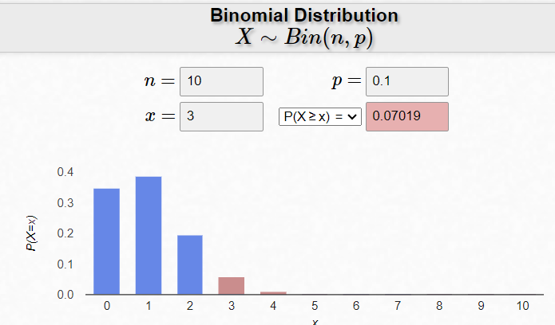
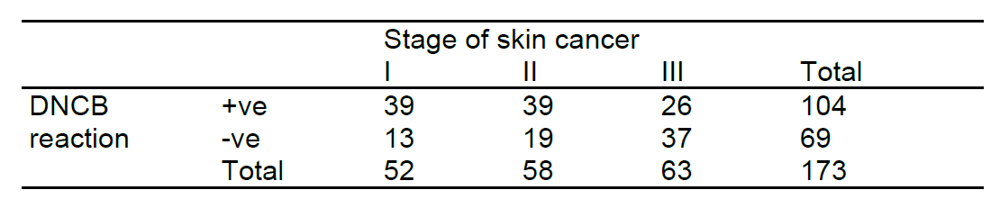
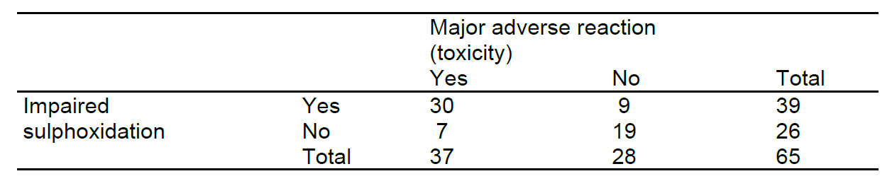
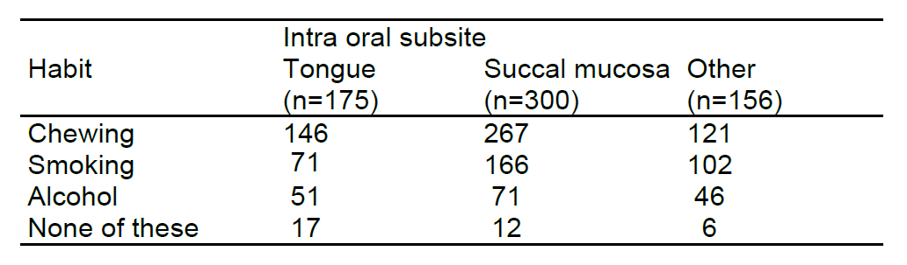
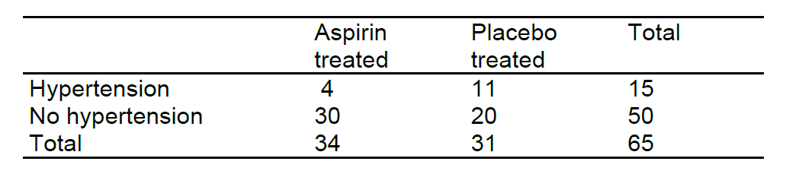

```{r setup, include=FALSE}

knitr::opts_chunk$set(echo = FALSE, 
                      warning = FALSE, 
                      message = FALSE, 
                      fig.align='center')
library(tidyverse)
library(haven)
library(gt)
library(scales)
library(modelsummary)
library(broom)
theme_set(theme_minimal())


```


## Exercise 1

In a sample of $n=10$ individuals $k=3$ were DM-patients. Test the null hypothesis
H0: $\pi=0.1$, where $\pi$ is the population proportion of DM in the population, against the one sided alternative that $\pi>0.1$. Calculate both exact and approximate P-values.

**Answer:** To answer the question, we need to calculate the p-value which is the probability of observing 3 or **more** DM-patients in a sample of 10, assuming that $\pi=0.1$. We use the `binom.test` function in the following way: 

```{r q1-b-t, echo=TRUE}

binom.test(
  x = 3, 
  n = 10, 
  p = 0.1, 
  alternative = "greater"
  ) 

```

You can also search a binomial calculator on the web (such as [this one](https://homepage.divms.uiowa.edu/~mbognar/applets/bin.html)) and use it to calculate (and visualize!) the probability of interest. 

```{r img-binom-calc1, echo=FALSE}

```


Calculating the normal approximation to the binomial distribution is an idea that is a legacy from a period before people had computers, and therefore does not make any sense IRL. However, just for the giggles, let's try to to do that. To calculate the normal approximation, recall that the our distribution has a $\mu=n\cdot p = 10\cdot 0.1 = 1$ and a $\sigma = \sqrt{n\cdot p\cdot (1-p)}=\sqrt{10\cdot0.1\cdot0.9}=0.949$. We will now use the `pnorm` function to calculate the same


```{r q1, echo=TRUE}

pnorm(q = 3, mean = 1, sd = sqrt(10*.1*.9), lower.tail = FALSE)

```

Which gives us $p = 0.0175$, a completely ridiculous result. This approximation is inadequate here. An approximation of a Binomial distribution (with parameters $n$ and $\pi$). But  a mormal distribution is only adequate if $n \ge 20$, $n\cdot\pi\gt5$ and  $n\cdot(1-\pi)\gt5$. In this exercise, $n = 10$, which is clearly too small.

## Exercise 2

A study was carried out to see if the proportion of patients whose skin did not respond to [dinitrochlorobenzene (DNCB)](https://en.wikipedia.org/wiki/2,4-Dinitrochlorobenzene), a contact allergen, is the same as the proportion of patients with negative response to [croton oil](https://en.wikipedia.org/wiki/Croton_oil), a skin irritant. The
following table shows the results of simultaneous skin reaction tests to DNCB and croton oil in 173 patients with skin cancer.

```{r q2-tbl, echo=TRUE}
library(janitor)
library(gt)
tribble(
  ~DNCB, ~`Croton oil`, ~Total, 
  "+ve", "+ve", 81, 
  "+ve", "-ve", 23,
  "-ve", "+ve", 48,  
  "-ve", "-ve", 21
) |> uncount(Total) |> 
  tabyl(`Croton oil`, DNCB) |> 
  adorn_totals(where = "both") |>  gt() |> 
  tab_spanner(label = "DNCB", columns = 2:4) |> 
  gtExtras::gt_theme_538()

```


(a) The authors reported no correlation’ between the two tests. Carry out an analysis appropriate to the clinical question posed. 

```{r q2-a-setup, echo = TRUE}

mx <- matrix(
  c(81, 48, 
    23, 21), 
  ncol = 2, byrow = 2, 
  dimnames = 
    list( 
         croton_oil =         # predictor
           c("+ve", "-ve"), 
         dncb =    # outcome
           c("+ve", "-ve")))

mx 


```

**Answer**: As a first step, let us compare the number of people who had a negative reaction to DNCB (48 + 21 = 69 out of 173) and to Croton-oil (23 + 21 = 44 out of 173) respectively. 

```{r prop-test, echo=TRUE}

prop.test(x = c(48 + 21, 23 + 21), n = c(173, 173)) |> 
  tidy()

```

Here we are testing the hypothesis that the probabilities in the population are the same, and we get p-value = 0.006, so we reject this assumption: the proportions are different in the population. Our confidence interval of the difference between the two estimates is [0.041, 0.248], an interval that does not include zero. 

It is essential to use an analysis appropriate for paired data, 173
respondents were tested twice with regard to the same outcome variable. The hypothesis test that the proportions of patients negative to the two skin
tests are the same is evaluated by running the McNemar Test. 


```{r}
mcnemar.test(mx, correct = FALSE) |> 
  tidy()
```

And we see that the hypothesis is rejected with a p-value of 0.0044. 
The statistic can also be calculated in the following way: 

$$
z^2 =\frac{(A-C)^2}{A+C}
$$
Where A and C are the discordant pair in our contingency matrix, in this case, 
The statistic is Chi-Square with 1-degree of freedom, which is equal to z-square. Since the significance cutoff for z is 1.96, it is 1.96^2 = 3.84 for z-square. Here this case 23 and 48. Calculating the statistic by hand, we find that:  

$$
z^2 =\frac{(23 - 48)^2}{23+48} = 8.8 
$$
And again we see that the result is larger than our threshold for rejecting the null hypothesis. 

(b) The results of the DNCB test were compared for patients with different stages of cancer, as shown in the following table. Is DNCB re-activity related to stage of cancer in these patients?


```{r DNCP-react}

```

**Answer**: We need to run a Chi-Square test

```{r q2-b}

mx <- matrix(
  c(39, 39, 26,  
    13, 19, 37), 
  ncol = 3, byrow = 2, 
  dimnames = 
    list( 
         dncb_react =         # predictor
           c("+ve", "-ve"), 
         cancer_stage =    # outcome
           c("I", "II", "III")))

mx

chisq.test(mx)

prop.test(x = c(39, 39, 26), n = c(39 + 13, 39 + 19, 26 + 37)) |> 
  tidy()

```


## Exercise 3

A randomized controlled clinical trial was carried out to compare the effects of a single dose of prednisolone and placebo in children with acute asthma (Storr el al, 1987). There were 73 children in the placebo group and 67 in the
prednisolone group. The results section of the paper begins with the following
statement: ‘2 patients in the placebo group (3%, 95% confidence interval -1 to
6%) and 20 in the prednisolone group (30%, 19 to 41%) were discharged at first
examination (P<0.0001).’ The methods section explains that this P value was
derived using Fisher’s exact test.

```{r q3-setup, echo = TRUE}

mx <- matrix(
  c(2, 73 - 2,    # placebo  
    20, 67 - 20), # treatment  
  ncol = 2, byrow = 2, 
  dimnames = 
    list( 
         arm =         # predictor
           c("placebo", "treatment"), 
         outcome =       # outcome
           c("discharged", "no-discharg")))


mx

```


(a) Was it reasonable to use Fisher’s exact test rather than the Chi-squared
test?

**Answer**: First, we can see that Fisher exact test is indeed significant, i.e, with a very small p-value, we reject the hypothesis that the variables are indpendent. 

```{r q3-a, echo=TRUE}

fisher.test(mx) |> 
  tidy()


```


To check whether Chi-square would work, we need the matrix of expectations. 

```{r q3-a-2, echo=TRUE}

csq <- chisq.test(mx)
csq$expected

```

We don't want to see too many values smaller than 5 (too many > 20%). And here we see that nobody is greater than 5, so we can definitely use chi-square, and indeed we find that it is significant, suggesting that we must reject the assumption of independence between the two variables. 

The observed frequencies were 2 and 20, but the expected frequencies
(under the null hypothesis) were about 10 so the Chi squared test could
have been used. (The expected number for a cell under the null hypothesis
can be calculated by multiplying the row total and column total of that cell
and divide by the overall total (in this case 140). For example the expected
number of discharged patients in the prednisolone group is 22*67 / 140 ≈
10.5. The assumption for Pearson’s Chi-square test is that at least 80% of
the cells have an expected value larger than 5; so for the two-by-two table it
means that all four cells have to have an expected value larger than 5).


```{r q3-a-3, echo=TRUE}

csq |> tidy()

```


(b) What is wrong with the confidence intervals, and what would be a better
analysis?

**Answer**: The confidence intervals are based on the Normal approximation. This is not valid for the very small proportion in the placebo group, and has led to an impossible negative lower limit. More fundamentally, it is not helpful to give confidence intervals for each group separately. The 95% confidence interval for the difference in proportions is much more useful; it is 16% to 39%. (Use the first formula in 6.2.1). HEre's how to calculate this difference in R: 

```{r q3b, echo = TRUE}

prop.test(c(20, 2), c(67, 73)) |> 
  tidy()

```


## Exercise 4

A study was made of 65 patients who had received or were receiving sodium
aurothiomalate as a treatment for rheumatoid arthritis (Ayesh et al, 1987). The
aim was to examine the possibility that toxicity to sodium aurothiomalate (SA)
might be linked to sulphoxidation capacity as assessed by the sulphoxidation
index (SI). Values of SI>6.0 were taken as indicating impaired sulphoxidation.
They obtained the following table: 


```{r q4-img-1}

```


The authors wrote: ‘The incidence of impaired sulphoxidation in patients showing SA toxicity (30/37; 81.0%) was significantly greater than in the group without adverse reaction (9/28; 32.1%) (x2 = 27.6. P<0.001). Similarly, the incidence of toxicity was significantly increased in those with impaired sulphoxidation (30/39: 76.9%) compared to those with extensive sulphoxidation (7/26; 26.9%) x2=36.2, P<0.001).’
(a) Why can’t both of the above Chi-squared tests be correct?

**Answer**:  There is only one Chi squared test for a 2 x 2 table, which can be
interpreted as either a comparison of the proportions in each row or in each
column. The two tests described should have given the same answer.

(b) Carry out a Chi-squared test of the data in the table and compare your
answer with the two results in the above paragraph.

```{r q4b, echo=TRUE}

# Using correction
# First test
prop.test(c(30, 9), c(37, 28), correct = TRUE) |> 
  tidy()

# Second test
prop.test(c(30, 7), c(39, 26), correct = TRUE) |> 
  tidy()

# Without correction
# First test
prop.test(c(30, 9), c(37, 28), correct = FALSE) |> 
  tidy()

# Second test
prop.test(c(30, 7), c(39, 26), correct = FALSE) |> 
  tidy()


```

The correct test statistic is either $\chi^2=15.90 (P<0.001)$ or $\chi^2=13.93 (P<0.001)$ depending on whether the continuity correction is used. Thus both of the quoted results were incorrect.

## Exercise 5 

Among patients with oral cancer registered in Kerala, India. Between 1982 and
1986. the relation between the site of the cancer and betel chewing, smoking or alcohol consumption was examined (Sankaranarayanan et al, 1989). The data for
patients aged >30 are summarized in the following table:


```{r q5-img-1}

```

(a) What sort of test could be performed to relate habit to site of cancer?

**Answer**: It is clear from the table that some patients had more than one of the three habits, as would be expected (for example: from 175 patients with cancer in the tongue, 146 chewed, 71 smoked, 51 drank alcohol and 17 “none”, in total 146 + 71 + 51 + 17 = 285 > 175). It is incorrect, therefore, to calculate X2 for the full 4 x 3 table. If we knew each patient’s habits, then a complex regression analysis could be performed, using methods described in Chapter 8. From the available data we could construct 3x2 tables for each habit and calculate the test statistic X2 on 2 degrees of freedom.


```{r q5, eval=FALSE}


mx <- matrix(
  c(146, 267, 121, # chewing  
    71,  166, 102, # smoking
    51,  71,  46,  # alcohol
    17,  12,  6    # none
    ), 
  ncol = 3, byrow = 4, 
  dimnames = 
    list( 
         arm =         # predictor
           c("chewing", "smoking", "alcohol", "none"), 
         outcome =       # outcome
           c("tonge", "suc_muc", "other")))


mx

chisq <- chisq.test(mx)
chisq$expected
chisq |> tidy()


```


## Exercise 6

Sixty-five pregnant women at a high risk of pregnancy-induced hypertension participated in a randomized controlled trial comparing 100mg of aspirin daily and a matching placebo during the third trimester of pregnancy (Schiff et al, 1989). The observed rates of hypertension are shown in the following table:


```{r q6-img-1}

```


Do these data suggest that daily aspirin reduces the risk of hypertension in the last trimester of pregnancy?

```{r q6, echo=TRUE}

# Compare proportions...
prop.test(c(11, 4), c(31, 34)) |> 
  tidy()


mx <- matrix(
  c(4,  11, # ht  
    30, 20 # no_ht
    ), 
  ncol = 2, byrow = 2, 
  dimnames = 
    list( 
         arm =         # predictor
           c("hypertension", "no_hypertension"), 
         outcome =       # outcome
           c("aspirin", "placebo")))


mx

chisq <- chisq.test(mx)
chisq$expected
chisq |> tidy()

```


**Answer**: The proportions of women developing hypertension were 0.1176 (4/34) in the aspirin group and 0.3548 (11/31) in the placebo group. The difference is 0.24 with a wide 95% Cl from 0.006 to 0.468 (according to SPSS it is 0.04 to 0.44). The Chi squared test with Yates’ correction (or continuity correction) gives $\chi^2=3.89~~(P=0.049)$. There is thus a suggestion that aspirin may reduce the risk of hypertension among pregnant women, but the wide Cl points to considerable uncertainty about the magnitude of the effect.

