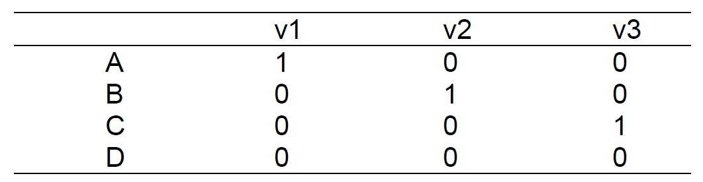
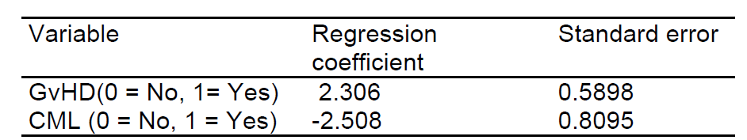

```{r setup, include=FALSE}

knitr::opts_chunk$set(echo = FALSE, 
                      warning = FALSE, 
                      message = FALSE, 
                      fig.align='center')
library(tidyverse)
library(broom)
library(haven)
library(gt)
library(scales)
library(modelsummary)
theme_set(theme_minimal())
library(ggfortify)
library(survival)
library(marginaleffects)


options(digits = 3)

```

## Exercise 1


File Ex9_1.sav contains data from a small experiment concerning motion sickness at sea (Burns, 1984). Subjects were placed in a cabin subjected to vertical motion for two hours. The outcome variable was the waiting time to emesis (vomiting). Some subjects requested an early stop to the experiment although they had not vomited, yielding censored observations, while others successfully survived two hours. The experiment was carried out with two "treatments": two combinations of movement accelerations and frequency. One combination was used for a group of 21 subjects, the other in a different group of 28 subjects.


(a) Calculate and plot Kaplan-Meier estimates of survival probabilities in the two groups.


**Answer**: See Lecture 8 slides for Kaplan-Meier curves and [R documentation](https://cran.r-project.org/web/packages/ggfortify/vignettes/plot_surv.html) on producing the plots.

```{r ex9a}
ex9 <- read_sav("data/ex9_1.sav") # %>% 
  # mutate(across(1:3, ~ as.numeric(.x)))

fit <- survfit(Surv(stime, censor) ~ expgroup, data = ex9)
autoplot(fit) + 
  labs(
    title = "Kaplan-Meier curves",
    y = "Cumulative survival", 
    x = "Time to emesis", 
    color = "Experiment group", 
    fill = "Experiment group") + 
  theme(legend.position = "bottom")

```


(b) Calculate the 95% CI for the difference between survival probabilities of the two groups after 60 minutes.

**Answer**: The estimated survival probabilities at 60 minutes are given below: 

```{r ex9b}

m <- coxph(Surv(time = stime, event = censor) ~ expgroup, data = ex9)

predictions(
  m, 
  newdata = datagrid(expgroup = 1:2, stime = 60), 
  type = "survival",
  ) %>% 
  as_tibble() %>% 
  select(expgroup, estimate, std.error, statistic, p.value, conf.low, conf.high)

```
And we see that the probabilities of survival at t = 60 seconds are $p = 90.4% (se = 0.0271)$ for the first experimental group and $p = 78%, (se = 0.0434)$ for the second group. The difference is  $0.124$ and the standard error of the difference is the root of the sum of squares of the standard errors for each group taken separately, i.e., 

$$
\sqrt{0.0271^2 + 0.0434^2} = 0.0512
$$


Alternatively, you can use the `comparisons` function as follows: 


```{r ex9b-1}

comparisons(
  m, 
  newdata = 
    datagrid(expgroup = 1, stime = 60), 
  type = "survival",
  ) %>% 
  as_tibble() %>% 
  select(estimate, std.error, statistic, p.value, conf.low, conf.high)

```

And it appears that the difference between the two survival probabilities is indeed $0.124 (se = 0.0705)$ with a confidence interval of $[-0.263; 0.0137]$. 


(c) Compare the two survival curves by logrank test.

**Answer**: As can be seen below, the logrank test statistic is 3.2, df=1, P=0.07. The two curves are not significantly different when tested at 5% level.

```{r ex9c}

survdiff(Surv(stime, censor) ~ expgroup, data = ex9)

```


(d) Use Cox regression to compare the two treatments; compare the result to that of the logrank test; calculate the hazard ratio and its 95% CI.

**Answer**: Using the group with motion frequency 0.167 as the reference, the regression coefficient is 0.904 (SE=0.521), the P-value is 0.083 and the confidence interval is $[-0.118; 1.93]$

```{r ex9d}
tidy(m, conf.int = TRUE, exponentiate = TRUE)
```


This is close (as we expect) to the result of the log-rank test. The hazard ratio (of frequency 0.33 to frequency 0.167) is HR=2.47, 95%-CI is 0.89 to 6.86.

(e) Two different persons undergo the experiment with different treatments. Estimate the probability that the waiting time until emesis under one of the treatments exceeds that under the other treatment.

**Answer**: The probability that the waiting time is shorter under the frequency 0.33 than under the frequency 0.167 is estimated as $2.45/(1+2.45)=0.71$. (Use the formula on page 9-10).


(f) Early stopping censored individuals could have been near to being sick. Take this into account and compare the two groups by the logrank test.

**Answer**: A possible solution is to consider the stopping individuals as experiencing the emesis, that is to consider their waiting times as exact (instead of censored). This results in a logrank value of 1.9, P=0.2.


```{r ex9f}
ex9 %>% 
  mutate(censor = ifelse(stime < 120, 1, censor)) %>% 
  survdiff(Surv(stime, censor) ~ expgroup, data = .) 


```


## Exercise 2

Subfertile women with a child wish may receive an in-vitro fertilization (IVF) treatment. In an observational study the waiting time until pregnancy was recorded. The women undergoing the IVF treatment were categorized (prior to the start of the treatment) in four groups, A, B, C and D, with respect to the type of infertility. The waiting times – some of them censored - of the groups were compared by means of Cox regression with the group variable entered as a categorical variable. The P-value of the Wald test with 3 df was 0.095. The dummy-variables v1, v2 and v3 were defined as follows:

```{r img-2, eval=FALSE}


```


The hazard ratios and P-values for the dummy variables v1, v2 and v3 were reported as 1.20 (P=0.30), 2.80 (P=0.02) and 1.05 (P=0.48).

(a) Which group is estimated to have the longest waiting time for pregnancy?

**Answer**: A HR greater than 1 corresponds to a shorter waiting time. (The event in this exercise is "getting pregnant". A larger hazard means a shorter waiting time). The HR’s of A:D, B:D and C:D all exceed 1, and so D has the longest waiting time.


(b) A researcher compared all pairs of groups by separate tests. She used the Bonferroni method to keep the type-I error of the entire procedure below 10%. Which differences were found to be significant?

**Answer**: There are 6 paired comparisons. Thus the Bonferroni corrected P-values are obtained by multiplying the separate P-values by 6. Although not all 6 pair wise P-values are listed, the largest possible HR, 2.8, has a P-value of 0.02, that is 0.12 when corrected. As all the other pair-wise P-values are probably larger, none of the pair-wise differences is significant at 5% level. (We are not 100% sure, groups sizes might differ and influence the Pvalues).


(c) Which assumptions are needed for the validity of Cox regression in this case?

**Answer**: Non-informative censoring and proportionality of hazard functions


## Exercise 3


Relation between survival and a number of variables was studied in 37 patients having a bone marrow transplant. Cox regression analysis using the occurrence of acute graft-versus-host disease (GvHD=1 if present and GvHD=0 if absent), diagnosis, recipient’s age and sex, donor’s age and sex, whether the donor had been pregnant and the type of the leukemia (CML=1 if chronic myeloid leukemia and CML=0 otherwise) yielded the following model:


```{r img-3, echo=FALSE}


```


(a) What is the interpretation of the opposite signs for the regression coefficients?

**Answer**: The opposite signs mean that high values of one variable and low values of the other variable are associated with an increased risk of dying. A positive regression coefficient means that high values of that variable are associated with worse survival, and conversely for a negative coefficient. Thus the model predicts that survival is worse for non-CML patients and those with GvHD.


(b) Calculate the relative risks of dying (hazard ratio) for the following patients relative to non-GvHD non-CML patients (i) with GvHD but not CML, (ii) CML but without GvHD, (iii) CML and GvHD.

**Answer**: We need to calculate the Linear Predictor LP for each group of patients. These are as follows:

non-GvHD & non-CML 0.000

-   GvHD & non-CML 2.306
-   non-GvHD & CML -2.508
-   GvHD & CML -0.202 (= -2.508 + 2.306)

The relative risk of dying relative to the non-GvHD non-CML group is simply $e^0 = 1$ as the LP for that group is zero. Thus the risks of dying in the other groups relative to non-GvHD non-CML patients are as follows:

-   GvHD & non-CML $\exp(2.306) = 10.03$
-   non-GvHD & CML $\exp(-2.508) = 0.08$
-   GvHD & CML $\exp(-0.202) = 0.82$ 


(c) Calculate the 95% confidence interval for the hazard ratio associated with GvHD.

**Answer**: The 95% Cl is given by the range $\exp(2.306)\pm 1.96\cdot 0.5898$ or $[3.16; 31.9]$


(d) Comment on the reliability of the Cox regression model in view of the sample size (37) and number of deaths (18).

**Answer**: A Cox model based on such a small sample would be extremely unreliable, as is indicated by the wide CI given above. It is the number of events, here deaths, that determines the power of a Cox analysis, not the number of subjects


